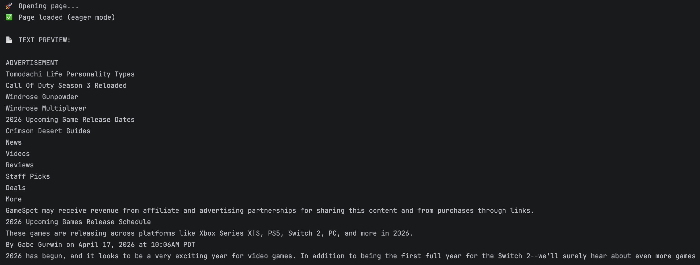
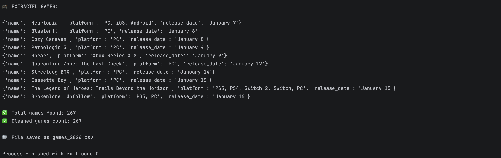

# 🎮 Game Release Web Scraper

A Python-based web scraper that collects upcoming game release data from GameSpot using Selenium.

---

## 📊 Features

* Extracts:

  * Game Name
  * Platform
  * Release Date
* Handles dynamic websites using Selenium
* Cleans and removes duplicate entries
* Sorts data by release date
* Saves results to a CSV file
* Includes search functionality

---

## 🖼️ Screenshots

### 🔹 Scraped Output Preview part 1

### 🔹 AScraped Output Preview part 2

---

## 📁 Project Structure

day-93-custom-web-scraper/
│
├── fetch.py
├── games_2026.csv
├── images/
│   ├── output_1.png
│   └── output_2.png
├── README.md
└── .gitignore

---

## ⚙️ Tech Stack

* Python
* Selenium
* Regex
* CSV

---

## ▶️ How to Run

pip install selenium
python fetch.py

---

## 📌 Output

games_2026.csv

---

## 🚀 Future Improvements

* Add filtering by platform
* Build a web UI (Flask)
* Scrape multiple years automatically

---

## 👤 Author

**Sijan Thapa**
GitHub: https://github.com/FermiumParadox
